# Engine Refactor Architecture Report

**Date:** 2025-03-15  
**Scope:** Prayer modules, 03_Runtime engines, TSX structure system, presentation/components.  
**Mode:** Analysis and documentation only. No code modifications.

---

## 1. Current Engine Inventory

TSX modules that act as runtime engines or major orchestrators, with path, approximate size, responsibility, UI vs logic share, state usage, and key dependencies.

### 1.1 Prayer App — Live Room and Orchestration

| File | Lines | Responsibility | UI % | Logic % | State | Key Dependencies |
|------|-------|----------------|------|---------|-------|------------------|
| [PrayerRoom.tsx](src/01_App/Christian/Prayer/PrayerRoom.tsx) | ~750 | Live room: join flow, WebRTC, content stage (slide/session/video/blank), annotation overlay, moderator panel, recording, export | 55 | 45 | `getSlice`/`writeSlice`, `getReplay`/`setReplay`, `subscribeState`/`getState`, `useState` (room, token, join, error) | prayer-room-session.state, usePrayerRoomWebRTC, useRoomRecording, prayer-room-api, session/annotation-timeline, export-session |
| [PrayerApp.tsx](src/01_App/Christian/Prayer/PrayerApp.tsx) | ~865 | App shell: mode (library/player/room/upload/guided/live/study), routing, metrics, TSXScreenWithEnvelope | 60 | 40 | `getState`/`subscribeState`, local `useState` (mode, selection) | TSXScreenWithEnvelope, PrayerRoom, PlayerModule, RecorderModule, structure |
| [room/ModeratorPanel.tsx](src/01_App/Christian/Prayer/room/ModeratorPanel.tsx) | ~586 | Host controls: recording, deck/slides, annotations, replay export, invite, participants | 75 | 25 | `getSlice`/`writeSlice`, `usePrayerRoomContext` | PrayerRoomContext, StudyPagesManager, SessionReplayViewer, StudyDeckManager |
| [room/SessionReplayViewer.tsx](src/01_App/Christian/Prayer/room/SessionReplayViewer.tsx) | ~260 | Replay playback: video + canvas, slide sync from session/annotation timelines, seek | 60 | 40 | Local `useState` (playing, currentTimeSec, durationSec) | session-timeline, annotation-timeline types; formatTime |
| [room/AnnotationOverlay.tsx](src/01_App/Christian/Prayer/room/AnnotationOverlay.tsx) | ~319 | Canvas drawing, strokes, toolbar (draw/highlight/erase/clear/undo), replay rendering | 70 | 30 | `getSlice`/`writeSlice`, `subscribeState`/`getState` | prayer-room-session.state |
| [PrayerPlayer.tsx](src/01_App/Christian/Prayer/PrayerPlayer.tsx) | ~206 | Media playback: play/pause, seek, speed, waveform, remaining time | 50 | 50 | Local `useState` (playing, currentTime, duration) | formatTime, waveform |
| [ReplayTimeline.tsx](src/01_App/Christian/Prayer/ReplayTimeline.tsx) | ~75 | Study-page timeline strip for seek (live_room replay) | 80 | 20 | Props only (prayer, durationSec, onSeek) | Prayer types |
| [PrayerRoomContext.tsx](src/01_App/Christian/Prayer/room/PrayerRoomContext.tsx) | ~71 | Context provider: roomId, recording, webrtc, export, callbacks, session-derived values | 10 | 90 | Reads from parent state/callbacks | PrayerRoom (provider) |

### 1.2 Prayer — Supporting Hooks and State (Non-TSX Where Noted)

| File | Lines | Responsibility | UI % | Logic % | State | Key Dependencies |
|------|-------|----------------|------|---------|-------|------------------|
| [room/usePrayerRoomWebRTC.ts](src/01_App/Christian/Prayer/room/usePrayerRoomWebRTC.ts) | ~100 | LiveKit room connection, participants, tracks, screen share, mute | 0 | 100 | Returns object (room, participants, screenShareStream, setMute) | getLiveKitToken, LiveKit (external) |
| [room/useRoomRecording.ts](src/01_App/Christian/Prayer/room/useRoomRecording.ts) | ~100 | Recording start/stop, MediaRecorder, blob, duration | 0 | 100 | Local refs + callback state | — |
| [room/prayer-room-session.state.ts](src/01_App/Christian/Prayer/room/prayer-room-session.state.ts) | ~130 | HICLARIFY slice: getSlice/writeSlice, getReplay/setReplay, deriveActiveSlideId | 0 | 100 | `getState`/`dispatchState` (state.values.prayerRoomSession, prayerRoomReplay) | state-store |
| [room/session-timeline.ts](src/01_App/Christian/Prayer/room/session-timeline.ts) | ~53 | In-memory session timeline (slide-change events) for replay/export | 0 | 100 | Module-level array + start time | — |
| [room/annotation-timeline.ts](src/01_App/Christian/Prayer/room/annotation-timeline.ts) | ~57 | In-memory annotation event timeline for replay/export | 0 | 100 | Module-level array + start time | — |

### 1.3 Components / Prayer (Recorder and Player Modules)

| File | Lines | Responsibility | UI % | Logic % | State | Key Dependencies |
|------|-------|----------------|------|---------|-------|------------------|
| [components/prayer/RecorderModule.tsx](src/components/prayer/RecorderModule.tsx) | ~449 | Standalone recorder: type (audio/video/screen), MediaRecorder, draft save, publish | 50 | 50 | Local `useState` (phase, blob, title, draft, etc.) | Local `formatTime` (duplicate), prayer-api, prayerDraftStore |
| [components/prayer/PlayerModule.tsx](src/components/prayer/PlayerModule.tsx) | ~60 | Thin wrapper: PrayerPlayer + ReplayTimeline when replayPrayer?.source === "live_room" | 90 | 10 | Props only | PrayerPlayer, ReplayTimeline |

### 1.4 Runtime Engines (03_Runtime)

| File | Lines | Responsibility | UI % | Logic % | State | Key Dependencies |
|------|-------|----------------|------|---------|-------|------------------|
| [03_Runtime/engine/core/json-renderer.tsx](src/03_Runtime/engine/core/json-renderer.tsx) | ~1611 | JSON tree → React; Registry, layout, palette, organs, skin | 30 | 70 | layout-store, palette-store, getState | registry, definitions, applyProfileToNode |
| [03_Runtime/engine/onboarding/OnboardingFlowRenderer.tsx](src/03_Runtime/engine/onboarding/OnboardingFlowRenderer.tsx) | ~441 | Onboarding flow UI: steps, blocks, navigation | 70 | 30 | Flow/engine state | IntegrationFlowEngine, WebsiteBlockRenderer |
| [03_Runtime/engine/onboarding/IntegrationFlowEngine.tsx](src/03_Runtime/engine/onboarding/IntegrationFlowEngine.tsx) | ~362 | Flow integration: step resolution, presentation model | 20 | 80 | Flow state | engine-contract, presentation-types |
| [03_Runtime/engine/site-runtime/GeneratedSiteViewer.tsx](src/03_Runtime/engine/site-runtime/GeneratedSiteViewer.tsx) | ~571 | Site block rendering, layout, palette | 60 | 40 | layout-store, palette | json-renderer, blocks |
| [03_Runtime/engine/core/ExperienceRenderer.tsx](src/03_Runtime/engine/core/ExperienceRenderer.tsx) | ~227 | Experience/template rendering | 50 | 50 | — | — |
| [03_Runtime/engine/core/registry.tsx](src/03_Runtime/engine/core/registry.tsx) | ~160 | type → React component map (Registry) | 5 | 95 | — | Many component imports |
| [03_Runtime/engine/bridge/WebsiteBlockRenderer.tsx](src/03_Runtime/engine/bridge/WebsiteBlockRenderer.tsx) | ~153 | Block-type rendering for onboarding | 60 | 40 | — | Registry, blocks |
| [03_Runtime/engine/system7/system7.tsx](src/03_Runtime/engine/system7/system7.tsx) | ~30 | System7 channel aggregator (identity, media, content, etc.) | 10 | 90 | — | Channels (identity, media, content, environment, parameters, style, timeline) |
| [03_Runtime/engine/system7/channels/*.tsx](src/03_Runtime/engine/system7/channels/) | ~11–13 each | Stub channels (timeline, media, identity, etc.) | 0 | 100 | — | — |

### 1.5 TSX Structure System

| File | Lines | Responsibility | UI % | Logic % | State | Key Dependencies |
|------|-------|----------------|------|---------|-------|------------------|
| [lib/tsx-structure/TSXScreenWithEnvelope.tsx](src/lib/tsx-structure/TSXScreenWithEnvelope.tsx) | ~160 | Envelope: resolve structure, apply palette/layout, StructureConfigProvider | 40 | 60 | resolveAppStructure, getDefaultTsxEnvelopeProfile | resolver, palette (CSS vars) |
| [lib/tsx-structure/resolver/convention.ts](src/lib/tsx-structure/resolver/convention.ts) | ~133 | Path → structureType + templateId (CO_LOCATED_MAP, default list) | 0 | 100 | — | types |
| [lib/tsx-structure/engines/*.ts](src/lib/tsx-structure/engines/) | varies | Per-type config (list, board, dashboard, editor, timeline, detail, wizard, gallery) | 0 | 100 | useStructureConfig() | resolver |

### 1.6 Presentation — Timeline and Organs

| File | Lines | Responsibility | UI % | Logic % | State | Key Dependencies |
|------|-------|----------------|------|---------|-------|------------------|
| [04_Presentation/.../TimelineOrganism.tsx](src/04_Presentation/components/organisms/tsx-organisms/TimelineOrganism.tsx) | ~85 | Timeline layout: Toolbar, Sidebar, TimelineRuler, LaneStrip, LaneOrgan; state.values.structure.blocksByDate | 70 | 30 | `getState`/`subscribeState`, structure.blocksByDate | tsx-organs (TimelineRulerOrgan, etc.), Section, Card |

---

## 2. Duplication Findings

### 2.1 Time Utilities

- **Shared:** [src/01_App/Christian/Prayer/utils/formatTime.ts](src/01_App/Christian/Prayer/utils/formatTime.ts) — `formatDuration(seconds)`, `formatTime(seconds)` (invalid → "—" / "0:00").
- **Consumers:** PrayerApp, PrayerRoom, PrayerPlayer, ModeratorPanel, SessionReplayViewer, ReplayTimeline (via PlayerModule), MomentsSection, PrayerTimerSelector, StudyPagesManager (plus local `formatTimeOptional`).
- **Duplicate:** [src/components/prayer/RecorderModule.tsx](src/components/prayer/RecorderModule.tsx) defines its own `formatTime(seconds)` (lines 21–24) with same m:ss behavior. Should use shared Prayer `utils/formatTime` or a common lib.

### 2.2 Session / Timeline Logic

- **session-timeline.ts** and **annotation-timeline.ts** both keep module-level arrays and a shared `sessionStartTimeSec` pattern; they are separate concerns (slide-change vs annotation events) but share the same “init at start, record with timestamp, get/clear” API pattern.
- **Replay:** Replay data lives in (1) HICLARIFY state via `getReplay`/`setReplay` (roomId → sessionTimeline + annotationTimeline), (2) SessionReplayViewer (receives timelines as props and derives current slide by time), (3) ReplayTimeline (study pages for seek). The “replay timeline” concept is split between state storage (prayer-room-session.state), in-memory recording (session-timeline, annotation-timeline), and two viewers (SessionReplayViewer, ReplayTimeline). Consolidating “replay timeline engine” (one place that owns current time, slide index, and annotation visibility for a replay) would reduce duplication.

### 2.3 State Update Patterns

- **getSlice / writeSlice** used consistently in Prayer room (PrayerRoom, ModeratorPanel, AnnotationOverlay, SlideViewer, SessionSlidesView). Single slice key `prayerRoomSession`; no duplicate slice logic.
- **deriveActiveSlideId(slice, hasScreenShare)** is the single place for “active slide for annotation/timeline”; no duplication there.

### 2.4 Media Control Logic

- **RecorderModule** (components/prayer): full MediaRecorder flow (getStream, start/stop, chunks, blob), draft save, publish. **useRoomRecording** (room): similar start/stop/duration/blob for live room. Both implement “record → blob → duration” but in different contexts (standalone vs in-room). Logic could be shared in a small “recording engine” (start/stop/onData/onStop) with UI-specific wrappers.

### 2.5 Event / Timeline Handling

- **SessionReplayViewer** implements `getCurrentSlideIndex(sessionTimeline, currentTimeSec)`, `getCurrentSessionSlide(sessionStudyPages, currentTimeSec)`, `getAnnotationsUpToTime(annotationTimeline, slideId, currentTimeSec)`. These are replay-specific derivations; they could live in a shared “replay timeline” utility so any replay UI (including future JSON-driven screens) reuses the same logic.

### 2.6 Networking / API

- Prayer room: [prayer-room-api](src/01_App/Christian/Prayer/room/prayer-room-api) (join, end, token, mute); no duplicate API layers in the scanned areas.

---

## 3. Wrapper Opportunities (Engine vs Wrapper Classification)

Classification: **A** = true runtime engine, **B** = wrapper around an engine, **C** = UI that should become a structure wrapper, **D** = logic that should move to shared utilities.

| Module | Classification | Notes |
|--------|----------------|-------|
| **PrayerRoom.tsx** | A (orchestrator) + mixed UI | Heavy engine: WebRTC, recording, session, annotation, export. Should be split: engine (room + session + recording + replay) vs thin “Room” wrapper that composes engine + layout. |
| **PrayerApp.tsx** | B / C | Shell; already under TSXScreenWithEnvelope (list). Could be a thin “list” wrapper that delegates to mode-specific wrappers (player, room, upload, etc.). |
| **ModeratorPanel.tsx** | B | Wrapper over session slice + PrayerRoomContext (recording, webrtc, export). Could be a “detail” or “dashboard” structure wrapper with minimal logic. |
| **SessionReplayViewer.tsx** | A (replay playback) | Replay engine (sync video + slide + annotations by time). Replay derivation logic should move to **D** (shared replay util); component becomes **B** over that engine. |
| **AnnotationOverlay.tsx** | A (annotation) + UI | Canvas drawing + stroke state in slice. Could be split: annotation engine (stroke list, serialize/deserialize for timeline) + thin overlay wrapper. |
| **PrayerPlayer.tsx** | A (media playback) | Playback engine. Already used by PlayerModule; keep as engine, PlayerModule stays **B**. |
| **ReplayTimeline.tsx** | B | Thin UI over prayer.studyPages + onSeek; already a wrapper. |
| **PrayerRoomContext.tsx** | B | Pure context provider; thin. |
| **usePrayerRoomWebRTC.ts** | A (WebRTC) | Engine (no UI). |
| **useRoomRecording.ts** | A (recording) | Engine (no UI). |
| **prayer-room-session.state.ts** | A (state) | Session/replay state engine. |
| **session-timeline.ts** / **annotation-timeline.ts** | A (timeline) | Pure logic engines. |
| **RecorderModule.tsx** | A + mixed | Recording + draft + publish + UI. Should use shared **D** formatTime; recording core could align with useRoomRecording or shared recording util. |
| **PlayerModule.tsx** | B | Thin wrapper over PrayerPlayer + ReplayTimeline. |
| **json-renderer.tsx** | A | Core JSON→React engine. |
| **OnboardingFlowRenderer.tsx** | B | Wrapper over IntegrationFlowEngine + blocks. |
| **IntegrationFlowEngine.tsx** | A | Flow/orchestration engine. |
| **TSXScreenWithEnvelope.tsx** | B | Wrapper that applies structure + palette; thin. |
| **TimelineOrganism.tsx** | C | UI that composes timeline organs; should be a “timeline” structure wrapper (data from state.values.structure). |

---

## 4. Structure Type Comparison

Eight structure types (from [src/lib/tsx-structure](src/lib/tsx-structure)): **list**, **board**, **dashboard**, **editor**, **timeline**, **detail**, **wizard**, **gallery**.

| Current Module | Current / Possible Structure | Notes |
|----------------|-------------------------------|--------|
| **PrayerApp** | list (resolved in [convention.ts](src/lib/tsx-structure/resolver/convention.ts)) | Already “Christian/Prayer/PrayerApp” → list. Can stay list; inner modes (library, player, room) can be sub-wrappers. |
| **PrayerRoom** | — | No structure type. Could be a **dashboard** (toolbar + content + sidebar) or **detail** (main + moderator panel). |
| **ModeratorPanel** | — | Could be **detail** (master = participants/slides, detail = controls) or a panel slot in a **dashboard** wrapper. |
| **SessionReplayViewer** | — | Could sit inside a **timeline** or **detail** wrapper (timeline = ruler + lanes; detail = video + slide list). |
| **TimelineOrganism** | timeline | Uses state.values.structure.blocksByDate; fits **timeline** structure (ruler, lanes, events). Should explicitly use timeline config from useTimelineConfig(). |
| **OnboardingFlowRenderer** | wizard | Step-based flow; aligns with **wizard** (steps, navigation). |
| **WorkspaceLayout** (Business) | dashboard | Already in convention as dashboard. |
| **HiClarifyOnboarding**, **GospelDiscipleship**, etc. | wizard | Already in convention. |

**Gaps:** PrayerRoom and ModeratorPanel are not yet mapped to a structure type in the resolver; assigning them (e.g. dashboard/detail) would align with the 8-type system and future JSON-driven layouts.

---

## 5. Contract Compliance Analysis

### 5.1 02 Contract Reports and ENGINE_LAWS

- **03_ENGINE_SYSTEM.md / 06_CONTRACTS_MASTER.md:** Trunk engines are invoked via action-registry or landing-page-resolver/behavior-listener. Prayer is TSX/domain-specific and does not go through action-registry; it uses state-store and its own slice (prayerRoomSession). So Prayer is **out of scope** for the “trunk” JSON/behavior path but follows the same **state pattern** (getSlice/writeSlice, one key, dispatchState("state.update")) as structure.actions.
- **ENGINE_LAWS (06_CONTRACTS_MASTER):** Wrapper law (read from child.props.node), preset override, param merge non-destructive, content on node — apply to JSON/Registry rendering. Prayer does not use Registry/node tree; so ENGINE_LAWS apply only indirectly (e.g. any future JSON-driven Prayer screens would need to comply).

### 5.2 Blueprint Contract (BUILD_BLUEPRINT_CONTRACT_V2)

- **Molecules/organs/organisms:** Blueprint defines 12 molecules, organs as TSX composed of molecules, organisms as TXT composing organs. Prayer room UI is custom TSX (canvas, video, panels), not built from the 12 molecules. So Prayer is **outside** the blueprint molecule/organ set; no violation, but also not benefiting from blueprint’s layout/content contracts.
- **Content/behavior:** If Prayer ever exposes buttons/cards/lists that are configurable via JSON, those should use the allowed molecule set and actionable verbs.

### 5.3 Build Protocols

- **CURSOR_CREATE_PLANS_PROTOCOL:** Plans under cursor, execute scope and produce verification report. This report is analysis only and does not replace a plan or verification.
- **TSX_ENGINE_BUILD_AUDIT_REPORT:** TSX screens should be wrapped in TSXScreenWithEnvelope and use structure resolution. **PrayerApp** is wrapped and resolved as list; **PrayerRoom** is not a top-level TSX screen in the same sense (it’s a mode inside PrayerApp). So envelope usage is **compliant** at the app level.

### 5.4 ENGINE_REDUNDANCY_REPORT / UNIVERSAL_ENGINE_BASELINE

- **Engine-registry vs action-registry:** Prayer does not register in engine-registry or action-registry; it is a domain app. System7 is in engine-registry as stub; real implementation in 03_Runtime/engine/system7. No conflict.
- **Duplicate Onboarding-flow-router** (logic/engines vs logic/orchestration): Not in Prayer; consolidation recommended in ENGINE_REDUNDANCY_REPORT and would not affect Prayer.

### 5.5 Violations / Inconsistencies

- **RecorderModule** uses a local `formatTime` instead of shared time utils (minor contract for “one place for time formatting”).
- **Prayer room** has no structure type in the resolver (PrayerRoom itself); only PrayerApp has a type (list). Assigning a type to the room view would improve consistency.
- **TimelineOrganism** reads `state.values.structure` directly; it does not use `useTimelineConfig()` from the structure engine. Aligning with the structure engine would match the intended “config from resolver” pattern.

---

## 6. Proposed Final Architecture

Target: **runtime engines → thin TSX wrappers → structure types (8) → layout + palette → JSON screens (future)**.

### 6.1 Diagram

```mermaid
flowchart TB
  subgraph engines [Runtime Engines]
    SessionState[prayer-room-session.state]
    ReplayState[replay state / getReplay setReplay]
    WebRTC[usePrayerRoomWebRTC]
    Recording[useRoomRecording + shared recording util]
    SessionTimeline[session-timeline]
    AnnotationTimeline[annotation-timeline]
    AnnotationEngine[annotation engine strokes + timeline]
    MediaPlayback[PrayerPlayer / media playback]
    ReplayPlayback[replay playback engine]
  end

  subgraph wrappers [Thin TSX Wrappers]
    PrayerAppWrapper[PrayerApp list wrapper]
    RoomWrapper[PrayerRoom dashboard/detail wrapper]
    ModeratorWrapper[ModeratorPanel wrapper]
    ReplayViewerWrapper[SessionReplayViewer wrapper]
    AnnotationOverlayWrapper[AnnotationOverlay wrapper]
    PlayerModuleWrapper[PlayerModule]
    ReplayTimelineWrapper[ReplayTimeline]
  end

  subgraph structure [Structure Types]
    List[list]
    Dashboard[dashboard]
    Detail[detail]
    Timeline[timeline]
    Wizard[wizard]
  end

  subgraph layout [Layout and Palette]
    Envelope[TSXScreenWithEnvelope]
    Palette[palette CSS vars]
  end

  subgraph future [Future]
    JSON[JSON screens]
  end

  engines --> wrappers
  wrappers --> structure
  structure --> layout
  layout --> future
```

### 6.2 Minimal Engine Set (Target)

| Engine | Responsibility | Current Location |
|--------|----------------|------------------|
| **Session state** | getSlice/writeSlice, deriveActiveSlideId | prayer-room-session.state.ts |
| **Replay state** | getReplay/setReplay (timelines for export) | prayer-room-session.state.ts |
| **WebRTC** | Room, participants, tracks, screen share | usePrayerRoomWebRTC.ts |
| **Recording** | Start/stop, blob, duration (unified for room + standalone) | useRoomRecording + shared recording util |
| **Session timeline** | Slide-change events for replay | session-timeline.ts |
| **Annotation timeline** | Annotation events for replay | annotation-timeline.ts |
| **Annotation engine** | Stroke list, serialize/deserialize, optional replay derivation | Extract from AnnotationOverlay |
| **Media playback** | Play/pause, seek, speed, time | PrayerPlayer |
| **Replay playback** | Current time → slide index, annotations up to time | New or extracted from SessionReplayViewer |

Target count: **~9** core engines (some can be one module, e.g. session + replay state). Thin wrappers then only subscribe to engines and render layout/structure.

### 6.3 Shared Utilities

- **Time:** Single `formatTime` / `formatDuration` (Prayer utils or moved to shared lib); remove RecorderModule duplicate.
- **Replay derivation:** `getCurrentSlideIndex`, `getAnnotationsUpToTime`, etc. in one replay util used by SessionReplayViewer and any future replay UI.
- **Empty / loading UI:** Use shared empty components where already introduced in stabilization.

### 6.4 Separation of Concerns

- **Engines:** No JSX (or minimal); expose state and callbacks.
- **Wrappers:** TSX that composes engines + structure config (useAutoStructure / useTimelineConfig etc.) and layout/palette from envelope.
- **Structure:** Resolver + 8 types drive layout and slots; wrappers consume config, not hardcoded layout.

---

## 7. Recommended Refactor Steps

Ordered list (analysis only; do not implement in this task):

1. **Extract time utilities**  
   Replace RecorderModule’s local `formatTime` with the shared Prayer `utils/formatTime` (or move formatTime/formatDuration to a shared lib and use from both Prayer and components/prayer).

2. **Extract replay derivation**  
   Move `getCurrentSlideIndex`, `getCurrentSessionSlide`, `getAnnotationsUpToTime` from SessionReplayViewer into a shared replay util (e.g. `replay-timeline.ts` or `replay-derivation.ts`) and have SessionReplayViewer call it. Keeps replay engine logic in one place.

3. **Split PrayerRoom into engine vs wrapper**  
   Introduce a “room engine” (or keep current hooks + state) that exposes: room join state, webrtc, recording, session slice, replay, and callbacks. PrayerRoom.tsx becomes a thin wrapper that subscribes to the engine and renders layout (dashboard or detail). Move as much logic as possible into hooks and state so the TSX is mostly composition.

4. **Reduce ModeratorPanel to a thin wrapper**  
   Panel already uses PrayerRoomContext and getSlice/writeSlice. Remove any remaining logic that could live in the room engine or context; keep only UI and structure (e.g. detail or dashboard slot).

5. **Align RecorderModule with shared recording**  
   Option A: Have RecorderModule use the same recording primitive as useRoomRecording (e.g. a shared `useRecording()` that returns start/stop/blob/duration). Option B: Keep both but extract a small “recording engine” (start/stop/onData/onStop) used by both. This reduces duplication and keeps a single place for “recording” behavior.

6. **Assign structure type to PrayerRoom**  
   In tsx-structure resolver (or convention), assign a structure type to the room view (e.g. dashboard or detail) so layout and slots can be driven by config later.

7. **Use structure config in TimelineOrganism**  
   Have TimelineOrganism resolve config via `useTimelineConfig()` (or useAutoStructure when structureType === "timeline") and use that config for layout/slots instead of reading state.values.structure directly. Aligns with ENGINE_LAWS and single control plane.

8. **Consolidate replay timeline surface**  
   Ensure “replay” has one state owner (getReplay/setReplay), one derivation module (replay util above), and one or two viewers (SessionReplayViewer for full replay, ReplayTimeline for study-page seek). Avoid adding new places that duplicate “current time → slide/annotations.”

9. **Optional: annotation engine module**  
   Extract from AnnotationOverlay: (1) stroke list + serialization for annotation-timeline, (2) optional “replay strokes for slide at time” helper. Overlay becomes a thin canvas + toolbar wrapper over that engine.

10. **Document engine boundaries**  
    Add a short ADR or section in 02_Contracts_Reports describing Prayer engines (session state, WebRTC, recording, session/annotation timeline, replay, media playback) and that they are domain engines, not in action-registry, but follow the same state-slice pattern as structure.

---

## References

- [02_Contracts_Reports/system-architecture/03_ENGINE_SYSTEM.md](src/02_Contracts_Reports/system-architecture/03_ENGINE_SYSTEM.md)
- [02_Contracts_Reports/system-architecture/06_CONTRACTS_MASTER.md](src/02_Contracts_Reports/system-architecture/06_CONTRACTS_MASTER.md)
- [02_Contracts_Reports/build_protocol/BUILD_BLUEPRINT_CONTRACT_V2.md](src/02_Contracts_Reports/build_protocol/BUILD_BLUEPRINT_CONTRACT_V2.md)
- [02_Contracts_Reports/cursor/ENGINE_REDUNDANCY_REPORT.md](src/02_Contracts_Reports/cursor/ENGINE_REDUNDANCY_REPORT.md)
- [02_Contracts_Reports/cursor/UNIVERSAL_ENGINE_BASELINE.md](src/02_Contracts_Reports/cursor/UNIVERSAL_ENGINE_BASELINE.md)
- [docs/TSX_ENGINE_BUILD_AUDIT_REPORT.md](docs/TSX_ENGINE_BUILD_AUDIT_REPORT.md)
- [.cursor/rules/TSX_STRUCTURE_ENGINE_OVERVIEW.md](.cursor/rules/TSX_STRUCTURE_ENGINE_OVERVIEW.md)
- [src/lib/tsx-structure/resolver/convention.ts](src/lib/tsx-structure/resolver/convention.ts) (structure type mapping)
- [src/01_App/Christian/Prayer/PRAYER_HICLARIFY_STATE_INTEGRATION_ANALYSIS.md](src/01_App/Christian/Prayer/PRAYER_HICLARIFY_STATE_INTEGRATION_ANALYSIS.md)
- [src/01_App/Christian/Prayer/PRAYER_FULL_HICLARIFY_REFACTOR_ANALYSIS.md](src/01_App/Christian/Prayer/PRAYER_FULL_HICLARIFY_REFACTOR_ANALYSIS.md)
