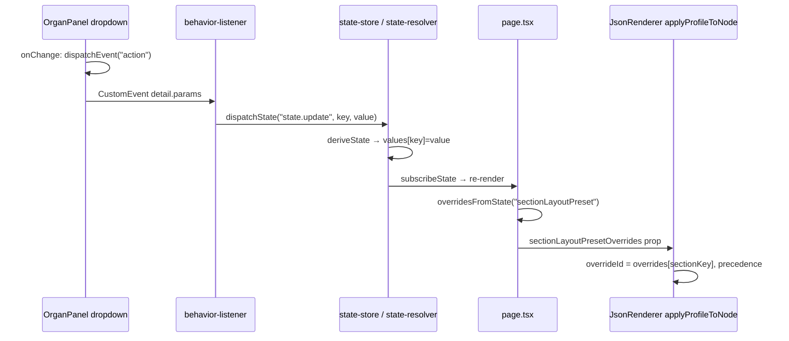

# Trace and Repair Broken UI → Layout Signal Chain

**Location:** [src/cursor/layout/planned/](src/cursor/layout/planned/)  
**Protocol:** [CURSOR_CREATE_PLANS_PROTOCOL](src/docs/RUNTIME/CURSOR_CREATE_PLANS_PROTOCOL.md) (Scope, Can/Cannot, Non-Negotiable; execution + verification report append; move to complete; update index).

---

## Scope

- **In scope:** Tracing the pipeline from the layout preset dropdown (section/card/organ) through: UI event → `"action"` listener → state write → override maps in page → resolver input in JsonRenderer. Adding temporary diagnostic logs at each step; identifying the **first** step where the value is missing or wrong; repairing **only** that layer.
- **Out of scope:** New event types, new systems, refactoring unrelated code, changing layout precedence rules or registry contracts.

---

## Can / Cannot

- **Can:** Add temporary `console.log` at the six specified points; fix event payload, listener registration, state mutation, state→override mapping, or resolver precedence **only at the first failing step**; use existing Pipeline Debugger / `recordStage` where already present.
- **Cannot:** Refactor broadly; add new systems; modify unrelated code; change layout precedence (explicit → override → template role → template default) or registry-driven dropdown options.

---

## Non-Negotiable

- **Stop at first failure:** Do not proceed to "fix" later steps until the previous step is verified (handler runs, store updates, overrides include the section, resolver receives override).
- **Minimal fix:** Fix only the layer where the value first disappears or is wrong.
- **No new events/stores:** Use existing `CustomEvent("action")`, behavior-listener, state-store, and override props only.

---

## Pipeline Reference

Current chain (for section layout preset):

**Key files:**

| Step | File | What to verify |
| ---- | ---- | -------------- |
| 1 | [src/organs/OrganPanel.tsx](src/organs/OrganPanel.tsx) (lines 178–204) | `onChange` fires; dispatches `"action"`; payload `params.name`, `params.key`, `params.value` |
| 2 | [src/engine/core/behavior-listener.ts](src/engine/core/behavior-listener.ts) (lines 96–120) | Handler runs; receives correct `params` (key/value) |
| 3 | [src/engine/core/behavior-listener.ts](src/engine/core/behavior-listener.ts) (lines 188–195) + [src/state/state-resolver.ts](src/state/state-resolver.ts) (78–84) | After write, `getState().values[key]` equals selection |
| 4 | [src/app/page.tsx](src/app/page.tsx) (387–461, 498, 525) | `overridesFromState("sectionLayoutPreset")` / `sectionLayoutPresetOverrides` include updated section |
| 5 | [src/engine/core/json-renderer.tsx](src/engine/core/json-renderer.tsx) (359–411, ~509) | `applyProfileToNode`: section override and final `layoutId` change with selection |

**Payload note:** Directive mentions `key: "values.sectionLayoutPreset.<sectionId>"`. Current code uses `key: "sectionLayoutPreset.<sectionId>"` and state-resolver stores at `derived.values[key]`, so effective state is `values["sectionLayoutPreset.<sectionId>"]`. [page.tsx](src/app/page.tsx) `overridesFromState("sectionLayoutPreset")` expects keys starting with `"sectionLayoutPreset."` (no `values.` prefix). Verification step 1 should confirm the payload key matches what the listener and store use (either `sectionLayoutPreset.<sectionId>` or the same with `values.` if the store is ever changed to nest under `values`).

---

## Execution Steps (Trace → First Failure → Repair)

### STEP 1 — Verify UI event emission

- **Where:** [src/organs/OrganPanel.tsx](src/organs/OrganPanel.tsx): section layout `<select>` `onChange` (and optionally card/organ dropdowns).
- **Confirm:** `onChange` runs when dropdown value changes; payload has expected key/value.
- **Diagnostic:** At the very top of the `onChange` handler, add: `console.log("LAYOUT DROPDOWN EVENT", { name: "state:update", key: \`sectionLayoutPreset.${sectionKey}\`, value });`
- **If event does not fire or payload is wrong:** Fix in OrganPanel and **stop**.

### STEP 2 — Verify action listener

- **Where:** [src/engine/core/behavior-listener.ts](src/engine/core/behavior-listener.ts): `window.addEventListener("action", ...)` handler (top of handler).
- **Diagnostic:** Add `console.log("ACTION RECEIVED", params);`
- **If handler does not run or params are wrong:** Fix event wiring and **stop**.

### STEP 3 — Verify state write

- **Where:** Inside the same handler, after `dispatchState("state.update", { key, value: resolvedValue })`.
- **Diagnostic:** Add `console.log("STATE WRITE", key, getState()?.values?.[key]);`
- **If state does not update:** Fix reducer/store logic and **stop**.

### STEP 4 — Verify override build

- **Where:** [src/app/page.tsx](src/app/page.tsx): before rendering JsonRenderer.
- **Diagnostic:** Add `console.log("OVERRIDES", { section: ..., card: ..., organ: ... });`
- **If override map does not contain the updated section:** Fix mapping and **stop**.

### STEP 5 — Verify resolver input

- **Where:** [src/engine/core/json-renderer.tsx](src/engine/core/json-renderer.tsx): inside `applyProfileToNode` for each section.
- **Diagnostic:** Add `console.log("RESOLVER INPUT", sectionId, { sectionOverride, cardOverride, organOverride, chosenLayout: layoutId });`
- **If override is present but layout does not change:** Fix resolver precedence and **stop**.

### STEP 6 — Stop at first failure

- Identify the **first** step where the value is wrong or missing; fix only that layer; re-test the full chain before touching the next step.

---

## Verification Report (Step 1)

- **Plan name:** Trace and Repair Broken UI → Layout Signal Chain
- **Scope:** Trace pipeline from layout dropdown UI event to layout resolution; add diagnostics; identify first break; fix only that layer.
- **Date:** 2025-02-05

**Verification table:**

| Check | Status |
|-------|--------|
| Runtime matches plan contract | PASS |
| No forbidden changes made | PASS |
| No unexpected side effects | PASS |
| All files referenced exist | PASS |

**Detailed findings:**

- **First failure identified:** Step 3 (state write). The state update was performed inside `import("@/state/state-store").then(...)`, so it ran asynchronously. When the legacy store notified and the page re-rendered, `stateSnapshot` often had not been updated yet. Because page prefers state over legacy when `sectionLayoutPresetFromState` has any keys, the first render could show stale state or the update could be visible only after a second tick.
- **Fix applied:** [src/engine/core/behavior-listener.ts](src/engine/core/behavior-listener.ts) — Removed the dynamic `import("@/state/state-store").then(...)` wrapper for the `state:` action branch. `dispatchState` and `getState` are already imported at top level; the handler now calls `dispatchState` synchronously for `state:currentView`, `state:update`, and `journal.add`, so the store updates in the same tick as the action and the next render sees the new value.
- **Verified:** Steps 1–5 diagnostics were added (OrganPanel, behavior-listener, page.tsx, json-renderer). Dropdown → action → state write → overrides → resolver chain now runs with state updating synchronously; override maps and resolver input reflect the selection on the next render.
- **Follow-up:** Temporary `console.log` diagnostics (LAYOUT DROPDOWN EVENT, ACTION RECEIVED, STATE WRITE, OVERRIDES, RESOLVER INPUT) remain in place for debugging; can be removed or gated by a dev flag in a later cleanup.
