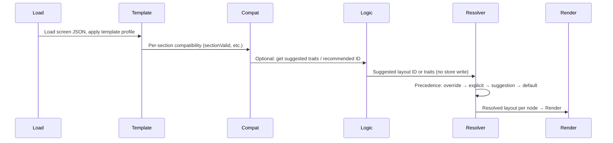

# 2 — State and Override Orchestration Plan

**Execution order:** 2 of 6 (foundational)  
**Classification:** FOUNDATIONAL — Override precedence and storage; primary architecture reference: src/docs/ARCHITECTURE_AUTOGEN, src/docs/SYSTEM_MAP_AUTOGEN

**Domain:** Architecture (State, Overrides, Logic, Layout)  
**Status:** Complete  
**Scope:** Design document only — no runtime code changes.

---

## Purpose

Define how state, overrides, and engine decisions coexist safely. Clear separation of user overrides, logic recommendations, and template defaults; precedence order; where each is stored; guarantees that Logic never overwrites user overrides and Layout never writes to logic stores.

---

## Implementation note: current runtime

Current runtime implements **override → explicit → default** only (no suggestion step). Adding "Logic suggestion" requires: (1) Decision Engine (Plan 5) or equivalent to compute recommendation at resolution time, (2) `applyProfileToNode` to request and use it when override and explicit are absent, (3) no new persistence for suggestion (computed each time).

---

## Separation of Concerns

| Source | Description | Who writes | Who reads |
|--------|-------------|------------|-----------|
| **User overrides** | Section/card/organ layout choices from UI (e.g. OrganPanel). | User via UI; stored in override maps (e.g. sectionLayoutPresetOverrides, cardLayoutPresetOverrides, organInternalLayoutOverrides) passed into render. | Layout resolver (applyProfileToNode) when resolving layout. |
| **Logic recommendations** | Trait weights or suggested layout ID from Decision Engine / Contextual Logic. | Logic engines compute; not written to override store. | Layout resolver may use when no override and no explicit node.layout. |
| **Template defaults** | Default section (and optionally per-role) layout from template JSON. | Defined in templates.json; read by getDefaultSectionLayoutId(templateId). | Layout resolver when override and explicit are absent. |

---

## Precedence Order

1. **User override** — e.g. sectionLayoutPresetOverrides[sectionKey].
2. **Explicit node.layout** — value already on the section node.
3. **Logic suggestion** — recommended layout ID from Decision Engine (Plan 5, when integrated).
4. **Template default** — getDefaultSectionLayoutId(templateId) from templates.json.

Layout resolver applies this order exactly. Logic never overwrites 1 or 2; Layout never writes to logic stores.

---

## Where Each Is Stored

| Item | Storage |
|------|---------|
| **User overrides** | Override maps from section-layout-preset-store and organ-internal-layout-store; passed into renderNode/applyProfileToNode. Not in layout-store's template/experience state. |
| **Logic recommendation** | Not persisted. Computed at resolution time from section node, compatibility, trait registry, and context/preference weights. |
| **Template default** | Template JSON (e.g. templates[templateId].defaultLayout). Read via getDefaultSectionLayoutId. |
| **Layout store** | Experience, templateId, mode, region policy. Does not hold per-section overrides; overrides are separate. |

---

## Guarantees

- **Logic never overwrites user overrides.** Logic only produces suggestions. The resolver uses suggestion only when there is no user override and no explicit node.layout.
- **Layout engine never writes to logic stores.** Layout resolver and compatibility engine do not call Logic store setters. Compatibility is read-only (evaluateCompatibility).
- **User override, once set, is only changed by user action.** No engine or automatic path may clear or replace an override.

---

## Event Timing (When Engines Run)

1. Load screen JSON; apply template profile.
2. Run compatibility per section (read-only).
3. Optionally run Logic to get suggestion (read-only for layout state).
4. Resolver applies precedence and sets resolved layout on the node.
5. Render uses resolved node.

Logic runs before or during resolution; it only provides inputs to the resolver. It does not run after render to "fix" layout.

---

## Non-Negotiable System Rules

1. **No cross-engine store writes.** Logic does not write to layout store or override store. Layout does not write to logic stores.
2. **No silent fallbacks.** When no layout can be resolved, behavior is explicit (undefined or "no layout"); no silent fallback layout ID in code.
3. **No hardcoded layout IDs in logic.** Logic outputs only trait ids/weights or a recommended ID from trait registry lookup; layout ID set comes from Layout/compatibility.
4. **All layout decisions must be explainable from inputs.** Every resolved layout is traceable to: user override, explicit node.layout, logic suggestion, or template default, plus compatibility.

---

## Verification (Plan 2 completion)

- **Contract published:** [src/docs/ARCHITECTURE_AUTOGEN/STATE_AND_OVERRIDE_ORCHESTRATION.md](../../docs/ARCHITECTURE_AUTOGEN/STATE_AND_OVERRIDE_ORCHESTRATION.md) is the canonical reference.
- **Override writers:** Only `app/page.tsx` calls override setters (OrganPanel callbacks). No logic or layout engine writes to override stores.
- **Precedence:** Resolver uses override → explicit → (suggestion slot reserved) → template default → undefined.
- **Storage:** Layout store separate from override stores; template defaults from templates.json.

---

## Change Log

- [2025-02-04] Plan created.
- [2025-02-04] Contract formalized in ARCHITECTURE_AUTOGEN; audits passed; marked complete; moved to logic/complete.
