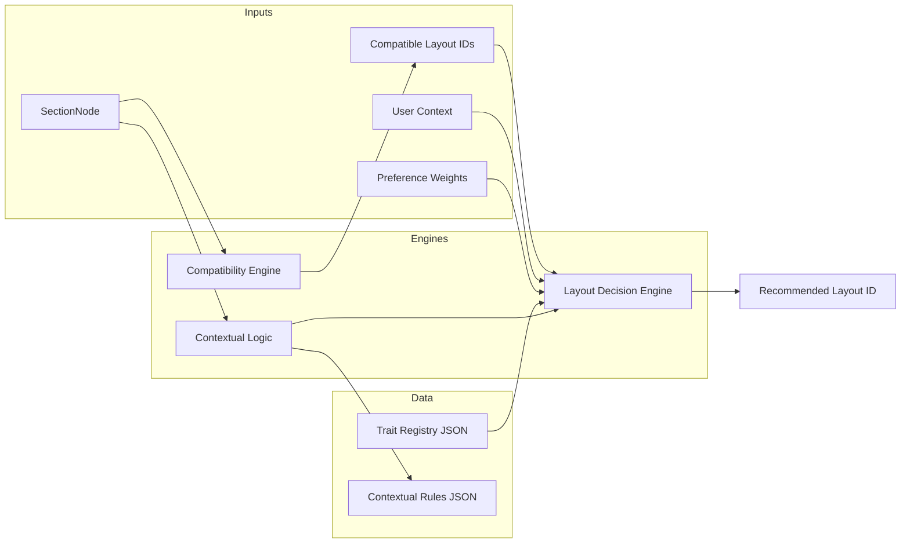

# Layout Decision Engine Plan

**Classification:** REFERENCE — Future decision engine; primary architecture reference: docs/SYSTEM_MASTER/

**Domain:** Logic (Layout Intelligence)  
**Status:** Planning  
**Scope:** Planning only — no code edits, no runtime changes.

---

## System Purpose

The Layout Decision Engine is the component that, given a section and its context, receives the set of **compatible** layout IDs (from the compatibility engine), optionally a suggested set from contextual logic, and produces a single **recommended** layout ID (or ranked list) for display or suggestion only. It never forces a choice: the dropdown and layout resolver continue to apply the precedence **override > explicit > suggestion > default**. The engine makes the system "smart" by scoring compatible options using traits, user context, and optional preference weights — without hardcoding any layout IDs.

---

## Inputs

| Input | Description | Source |
|-------|-------------|--------|
| **Section node** | The section tree node; used for available slots and content hints when combining with contextual logic. | Caller (e.g. renderer or dropdown). |
| **User context** | Optional dimensions: screen size band (e.g. `narrow`, `medium`, `wide`), density preference (e.g. `compact`, `default`, `spacious`), content type if available. | UI, viewport API, or assumed defaults; supplied as a plain object. |
| **Compatible layout IDs** | Set of layout IDs that pass compatibility for this section (e.g. `evaluateCompatibility(..., sectionLayoutId: id).sectionValid === true`). | Compatibility engine + filter over `getLayout2Ids()`. |
| **Optional contextual suggestion** | Trait set or trait weights from the Contextual Layout Logic (e.g. "stacked", "narrow") for this section. | Contextual Layout Logic plan output. |
| **Optional preference weights** | Trait id → number (e.g. `media-prominent: 2`, `dense: -1`) from the User Preference Adaptation layer. | User Preference Adaptation plan output. |

The engine does not read from the layout store or from the section node's `layout` field to determine the candidate set; the caller supplies the compatible IDs. The engine only scores and ranks.

---

## Decision Model

### Trait definitions in JSON

A single source of truth (e.g. `layout-traits.json` or `trait-registry.json`) maps each layout ID to a set of trait identifiers. Example traits: `media-prominent`, `split`, `stacked`, `grid`, `narrow`, `centered`, `full-bleed`. No layout IDs appear in engine code; the engine loads the registry and looks up traits by layout ID at runtime.

**Example registry shape:**

```json
{
  "description": "Layout ID → trait identifiers for scoring. No layout IDs in code.",
  "layoutTraits": {
    "hero-centered": ["centered", "wide", "text-prominent"],
    "hero-split": ["media-prominent", "split", "wide"],
    "hero-split-image-right": ["media-prominent", "split", "wide"],
    "content-stack": ["stacked", "contained"],
    "content-narrow": ["stacked", "narrow"],
    "features-grid-3": ["grid", "multi-item", "contained"],
    "image-left-text-right": ["split", "media-prominent", "contained"]
  }
}
```

New layouts are added by editing this JSON only.

### Context mapping

A JSON or config file maps "user context" dimensions to preferred trait sets or trait weights. Dimensions are named (e.g. `viewportBand`, `density`, `contentType`) and supplied by the caller (e.g. from UI or defaults). The config might look like:

- **Viewport band → trait weights:** e.g. `narrow` → prefer `stacked`, `narrow`; `wide` → prefer `split`, `wide`.
- **Density → trait weights:** e.g. `compact` → prefer `dense`; `spacious` → prefer `stacked`, `wide`.

Weights are numeric; the scoring formula sums (context weight + preference weight) for each trait present on a layout. Context mapping is data-driven; no layout IDs in the config.

### Scoring

For each compatible layout ID:

1. Look up the layout's traits from the trait registry.
2. For each trait, obtain a combined weight: (context weight for that trait, if any) + (preference weight for that trait, if any). Missing trait → 0.
3. Score = sum over the layout's traits of that combined weight. Optionally add a small tie-breaker (e.g. registry order or stable sort) so the result is deterministic.
4. Sort compatible IDs by score descending; the first is the recommended layout ID.

Formula is data-driven: weights come from context config and preference memory; the engine never embeds layout IDs or magic numbers.

### Output

- **Primary:** One recommended layout ID (or an ordered list of compatible IDs by score).
- **Optional:** Explanation object (e.g. `{ recommendedId: "hero-split", matchedTraits: ["media-prominent", "split"], score: 3 }`) for debugging and dropdown "suggested" badge.

---

## Data Sources

| Data | Source |
|------|--------|
| Layout IDs (candidate set) | Caller filters `getLayout2Ids()` (or equivalent) by `evaluateCompatibility(sectionNode, sectionLayoutId, ...).sectionValid`. |
| Trait registry | New JSON: e.g. `layout-traits.json` or `trait-registry.json` under logic or config. |
| Context → weights | New JSON/config: e.g. `context-trait-weights.json` or section in a shared config. |
| Preference weights | User Preference Adaptation plan: trait id → number (read-only for this engine). |

No layout IDs or trait lists are hardcoded in TypeScript; all come from JSON or from the compatibility/layout resolvers.

---

## Integration Points

### Compatibility engine

The Decision Engine runs **only** on layouts that are already compatible. The input candidate set must be exactly the set of layout IDs for which `evaluateCompatibility({ sectionNode, sectionLayoutId: id, ... }).sectionValid === true` (and similarly for card/organ if in scope). The Decision Engine does not bypass or override compatibility; it only ranks within the compatible set.

### Contextual Layout Logic

The Contextual Layout Logic produces suggested traits or contextual trait weights per section. The Decision Engine accepts this as an optional input and merges it into scoring (e.g. by adding contextual weights to the per-trait sum). No layout IDs flow from Contextual Logic; only traits or weights.

### User Preference Adaptation

Preference weights (trait id → number) are an optional input. The engine adds them to the per-trait sum when scoring. Preference is additive; it does not replace compatibility or context.

### Dropdown and resolver

The layout resolver and dropdowns (e.g. OrganPanel, SectionLayoutDropdown) may call the Decision Engine to get a recommended layout ID when there is no user override. They use it only for suggestion (e.g. badge or default selected value); user choice always overrides. Resolution order remains: **override > explicit node.layout > suggestion > template default**.

---

## Dropdown Suggestion (Optional)

Dropdowns may:

- Show a "suggested" badge next to the layout ID that matches the Decision Engine recommendation.
- Pre-select the recommended ID when the current value is unset and no override exists.

Suggestion is advisory only. The user can select any compatible option; the engine never writes to the layout store or to the section node.

---

## Safety Rules

1. **No hardcoded layout IDs** in engine or scoring code. Layout IDs exist only in JSON (trait registry, page layouts, requirement registries) and in data passed in at runtime.
2. **No writing** to layout store or to node.layout. The engine is read-only for layout state.
3. **No override** of user override, explicit node.layout, or template default. The engine only provides a recommendation; the resolver applies precedence.
4. **Explainable output:** The engine can return why a layout was recommended (traits, score) for debugging and UX.

---

## Future Expansion

- **Pluggable scoring functions:** Allow different scoring formulas (e.g. multiplicative, capped) via config or strategy.
- **Additional context dimensions:** e.g. role, template, experience (website/app/learning) without hardcoding layout IDs.
- **A/B or experiment scoring:** Weights or formulas driven by experiment config; still trait-based.
- **Explainability API:** Structured explanation (traits, weights, source of each weight) for dev tools and support.

---

## Data Flow (Overview)



---

*This document is planning only. No implementation changes are implied until explicitly scheduled.*
