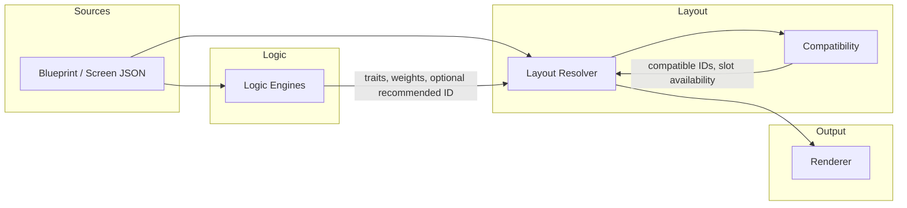

# Logic ↔ Layout Contract Plan

**Classification:** FOUNDATIONAL — Logic–layout boundary; primary architecture reference: docs/SYSTEM_MASTER/

**Domain:** Architecture (Logic + Layout)  
**Status:** Planning  
**Scope:** Design document only — no runtime code changes.

---

## Purpose

Define the formal interface between Logic engines and the Layout system. Logic suggests; Layout resolves. No direct store mutations across layers.

---

## What Logic Is Allowed to Send to Layout

| Data | Description | Constraint |
|------|-------------|------------|
| **Trait sets / trait weights** | Suggested traits (e.g. `["stacked", "narrow"]`) or contextual weights (e.g. `{ "split": 1, "media-prominent": 1 }`). | No layout IDs. Output from Contextual Layout Logic and consumed by Layout Decision Engine for scoring. |
| **Intent signals** | User state hints: viewport band, density preference, content type. | Used for scoring only; not stored in Layout. |
| **Recommended layout ID** | When Decision Engine scores compatible IDs, it may output one recommended ID. | Derived only from trait registry + compatible set; never hardcoded. Logic never writes this to any store. |

Logic does **not** send: raw layout IDs from rules, direct store writes, or overrides. Layout IDs in Logic exist only as lookup results from the trait registry over the compatible set supplied by Layout.

---

## What Layout Is Allowed to Expose Back

| Data | Description | Source |
|------|-------------|--------|
| **Capabilities** | Available slots for a section (e.g. heading, body, image, card_list). | `getAvailableSlots(sectionNode)` from Layout compatibility layer. |
| **Slot availability / layout compatibility** | Which layout IDs are structurally valid for a section/card/organ. | `evaluateCompatibility({ sectionNode, sectionLayoutId, ... })` → `{ sectionValid, cardValid, organValid?, missing }`. Read-only. |
| **Layout ID sets** | Full list of section/card/organ layout IDs (e.g. `getLayout2Ids()`, page layout IDs) and the filtered compatible subset. | Layout JSON and requirement registries; filtering by compatibility. |

Layout does **not** expose: write APIs for Logic to mutate layout store or node.layout. Layout never asks Logic to "apply" a layout; Layout resolver applies precedence and writes.

---

## Rule: Logic Suggests, Layout Resolves

- **Logic** produces suggestions (traits, weights, or a recommended layout ID from scoring). It does not write to layout store or to `node.layout`.
- **Layout resolver** (e.g. `applyProfileToNode` + `getDefaultSectionLayoutId`) is the single place that chooses the final layout ID using precedence: override → explicit → suggestion → default.
- **No direct store mutations across layers:** Logic engines do not call Layout store setters; Layout does not call Logic store setters.

---

## Event Flow

**Pipeline:** Blueprint → Logic (suggestions) → Layout Resolver (compatibility + precedence) → Renderer.

---

## Determinism Rules

- **Same inputs ⇒ same layout result.** Inputs: section node, template ID, user overrides, compatible layout set, trait/context weights.
- No silent fallbacks: if no default or suggestion, result is explicit undefined / "no layout" path; no hidden fallback layout ID in code.
- All layout decisions are explainable from: override, explicit node.layout, suggestion (from Logic), template default, and compatibility result.

---

## Non-Negotiable System Rules

1. **No cross-engine store writes.** Logic does not write to the layout store or to node.layout. Layout does not write to logic stores.
2. **No silent fallbacks.** When no layout can be resolved, behavior is explicit (e.g. undefined or "no layout" path); no silent fallback to a different layout ID in code.
3. **No hardcoded layout IDs in logic.** Logic rules and engine code reference only trait identifiers and weights. Layout ID set comes from Layout/compatibility; layout ID selection uses trait registry lookup only.
4. **All layout decisions must be explainable from inputs.** Every resolved layout can be traced to: user override, explicit node.layout, logic suggestion, or template default, plus compatibility (sectionValid/cardValid/organValid).

---

*This document is planning only. No implementation changes are implied until explicitly scheduled.*
