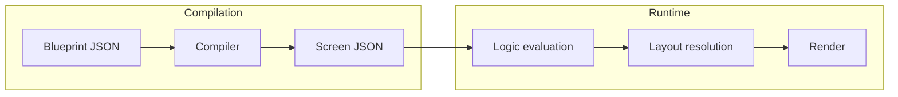

# Blueprint → Runtime Wiring Plan

**Classification:** FOUNDATIONAL — Compilation vs runtime boundary; primary architecture reference: docs/SYSTEM_MASTER/

**Domain:** Architecture (Blueprint / Compiler + Layout + Logic)  
**Status:** Planning  
**Scope:** Design document only — no runtime code changes.

---

## Purpose

Define how Blueprint JSON becomes runtime behavior across Layout and Logic. Where compilation stops and runtime begins; which fields are static vs dynamic; rules preventing blueprint from hardcoding layout fallbacks.

---

## Flow Overview

**Blueprint JSON → Compiler → Screen JSON → Logic evaluation (optional) → Layout resolution → Render.**

- **Compilation:** Blueprint/source (e.g. blueprint.txt + content.txt) is compiled to app.json / screen JSON (screen tree with sections, roles, content).
- **Runtime:** JsonRenderer loads screen JSON; applies template profile; runs compatibility and layout resolution (override → explicit → suggestion → default); renders.

---

## How Blueprint Fields Map

### To Logic inputs

- **Section node:** Structure, children, content. Used for slot availability (`getAvailableSlots(sectionNode)`) and for contextual rules (content descriptors, counts). No layout IDs in rules.
- **Roles:** header, hero, content, footer, etc. Used as context for trait hints or scoring; not as layout ID source. Logic consumes only structure and traits/weights.

### To Layout presets

- **Template ID** from layout store / profile selects which template to use.
- **Template JSON** (e.g. `templates.json`): `defaultLayout` and per-role layout IDs (e.g. `templates[templateId][sectionRole]`). Source: `getDefaultSectionLayoutId(templateId)`, template profiles. No layout ID fallbacks in code; defaults only in template JSON.

### To Organ roles

- **Section role** (e.g. hero, features) is used for: (1) template map lookup for section layout default, (2) organ internal layout compatibility (requirement registry keyed by organ/role). Organ layout IDs and requirements live in Layout (e.g. organ-layout-profiles, organ-internal-layout-requirements.json).

---

## Where Compilation Stops and Runtime Begins

| Phase | Boundary | Responsibility |
|-------|----------|----------------|
| **Compilation** | Blueprint/source → screen tree (app.json, screen JSON). | Compiler produces structure and content; may attach roles. No layout resolution. |
| **Runtime** | Screen JSON loaded by JsonRenderer. | Apply template profile, overrides, compatibility, layout resolution (override → explicit → suggestion → default), then render. |

Layout IDs are not "compiled in" from Blueprint; they are resolved at runtime from template + overrides + Logic suggestion + compatibility.

---

## Static vs Dynamic

| Kind | Examples |
|------|----------|
| **Static** | Template definitions (templates.json), layout requirement registries (section/card/organ), trait registry, page-layouts.json. |
| **Dynamic** | User overrides (section/card/organ layout choices), resolved section layout ID per node, compatibility result per node (sectionValid, cardValid, organValid). |

Blueprint and template data define defaults and structure; they do not hardcode runtime layout fallbacks in logic.

---

## Flow Diagram

---

## Rules: No Hardcoded Layout Fallbacks from Blueprint

- **Template defaults only in template JSON.** Default section layout comes from `templates[templateId].defaultLayout` (or equivalent). If template is missing or has no defaultLayout, result is undefined; no code-level fallback layout ID.
- **Blueprint/compiler must not emit layout IDs** as the only or mandatory path. Layout IDs are chosen at runtime by Layout resolver using compatibility and precedence.
- **New layouts** are added via JSON/registries (page-layouts, requirement registries, trait registry); not by hardcoding in Blueprint or compiler logic.

---

## Non-Negotiable System Rules

1. **No cross-engine store writes.** Blueprint/compiler does not write to layout or logic stores; runtime resolver is the single writer for resolved layout on the node.
2. **No silent fallbacks.** Missing template or defaultLayout yields explicit undefined / "no layout" path; no silent fallback to a different layout ID in code.
3. **No hardcoded layout IDs in logic or blueprint rules.** Layout IDs exist in JSON (templates, page-layouts, requirement registries, trait registry); Logic and Blueprint reference only structure, roles, and traits.
4. **All layout decisions must be explainable from inputs.** Resolved layout is traceable to: template default, role map, user override, explicit node.layout, logic suggestion, and compatibility.

---

*This document is planning only. No implementation changes are implied until explicitly scheduled.*
