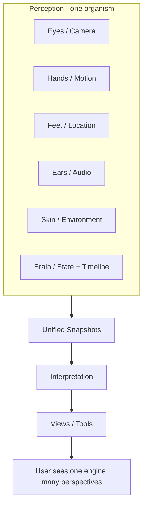

# Unified Input Engine — Master Plan v2

**Purpose:** Re-evaluation and upgrade of the Unified Input Engine concept. Builds on the original Compatibility & Architecture Plan. Architecture and analysis only — no implementation.

---

## Part 1 — Summary of Original Plan

### What the original plan solved

- **Inventory:** Mapped existing capability system, sensor stubs, sensor gates, System7 routing, environment/media bridges, timeline/state architecture, JSON pipeline, and action system. One source of truth for “what exists.”
- **Gap list:** Identified missing normalized snapshot format, snapshot storage, time-based semantics, calibration, reusability, bridge coverage, composability, and tool contract.
- **Compatibility strategy:** Additive-only layering (snapshot store, optional state intent); no replacement of state-store, capability, or System7 contracts.
- **Phasing:** Foundation → Snapshot capture → Calibration → Tool templating → Multi-input fusion.
- **Risk:** Called out state-resolver, environment-bridge async, sensor signatures, channel list, and capability domains; listed what must remain untouched.
- **Potential:** Estimated 10+ distinct tools from one snapshot + calibration layer with tool templates.

### Gaps that remain after v1

- **Mental model:** Original plan is “sensors → tools” with a snapshot layer in between. It does not yet frame the system as one **organism** (inputs informing each other, acting together).
- **True foundation:** v1 introduces “InputSnapshot” and “snapshot store” but does not name a single minimal core that everything else reduces to.
- **Exponential structure:** Phases are sequential; structural “multipliers” (one model, one calibration, one fusion) are not made explicit as architecture drivers.
- **Cross-connection:** How camera + motion + time, or location + timeline, or audio + identity combine is not analyzed; tools are still listed by primary source.
- **Simplification:** “Easier to reason about, expand, test, build, scale” is not systematically answered.
- **Velocity:** No explicit comparison of “old way vs new way” for time to first tool, next 10 tools, or 50+ tools.
- **UX model:** “One engine, infinite perspectives” and switch-based capability exposure are not spelled out as the user-facing outcome.
- **Build order:** What unlocks the most power first is implied (foundation → capture) but not argued from first principles.

### Assumptions made in v1

- Snapshot store can be separate from state-store (optional state intent only if UI needs it).
- Calibration is a “pass” over raw snapshots; raw is retained.
- Tool templates declare sources and bind to UI/export; runtime resolves snapshot + calibration.
- System7 channel contract stays; new layer feeds it.
- Capability and sensor gates stay as-is; no new domains required for the core model.
- Fusion is a later phase (multi-input fusion after tool templating).

---

## Part 2 — Re-evaluation: The True Foundation

### From first principles

**Old framing:** Sensors → tools (with snapshot + calibration in the middle).

**New framing:** **Inputs → Snapshots → Interpretation → Tools.**

- **Inputs:** Any source of reality that can be read: camera, audio, motion, orientation, location, device, screen, battery, network, timeline state, planner state, relationship state, user actions, System7 channels. These are not “sensors” in the narrow sense — they are **perception sources**.
- **Snapshots:** A single, time-stamped, source-tagged capture of one or more inputs. The snapshot is the **smallest reusable unit**. One format, one contract.
- **Interpretation:** Derivation from snapshots: calibration (raw → adjusted), fusion (multiple sources → one coherent view), and higher-order state (timeline, journal, scans). Interpretation turns snapshots into **meaning**.
- **Tools:** Level, step tracker, location timeline, decibel meter, voice tools, etc. Tools are **views over snapshot + interpretation**. They do not own inputs; they consume a shared layer.

### The simplest possible core

The minimal core is:

1. **One snapshot type** — One canonical shape: `{ t, source, payload, meta? }` (time, source id, payload, optional calibration/fusion meta). Every input, once captured, becomes this.
2. **One append-only log** — Snapshots append to a single log (or store with log semantics). No separate “sensor log” vs “state log” for input capture; one **input timeline**.
3. **One read API** — “Give me snapshots for sources [X] in window [t0, t1]” or “Give me latest for [X].” All tools use this. No tool-specific ingestion.

From this core, calibration is “interpretation over the log.” Fusion is “interpretation that combines sources.” Tools are “views that query the log + interpretation.”

### What is reusable across everything

- **The snapshot contract** — Reusable by every input type and every tool.
- **The log** — Reusable as the single timeline for replay, debugging, and multi-tool consumption.
- **The capability gate** — Reusable as the single switch for “is this source allowed?” before capture or read.
- **The interpretation layer** — Reusable so that calibration and fusion are defined once and consumed by many tools.

---

## Part 3 — Exponential Simplifiers

Structural ideas that reduce build time, duplication, and complexity while multiplying output:

| Simplifier | What it does | Why it multiplies |
|------------|--------------|-------------------|
| **One snapshot model** | Every input becomes the same shape and goes to the same log. | One format to document, test, and optimize. Every new input is “add a source + capture to log.” Every new tool is “query log + interpret.” No N×M integration. |
| **One calibration layer** | Single calibration store and single pass (raw → calibrated). All tools read calibrated by default; raw available for audit. | One place to add new sensor calibration; all tools that use that sensor benefit. New tool categories (level, step, presence) don’t each implement calibration. |
| **One fusion layer** | One fusion contract: “combine sources [A,B,C] into fused view.” Presence, pattern, productivity are different **fusion recipes**, not different systems. | Adding “location + motion + time” as a recipe unlocks presence; adding “journal + timeline + scans” unlocks productivity. One fusion engine, many recipes. |
| **One state timeline** | State log (current) and input snapshot log share the same **time axis**. Interpretation can correlate “what the user did” with “what the device saw.” | Enables “what was happening when the user did X?” and “what did the user do when the device saw Y?” without building custom pipelines per tool. |
| **One tool contract** | Every tool is a descriptor: required sources, optional sources, interpretation (calibration, fusion recipe), and view (JSON template or component). | Adding a tool = adding a descriptor and a view. No new pipelines, no new capture logic. Build time for tool N approaches zero as N grows. |

Together these turn the system into: **one capture path, one log, one interpretation layer, many descriptors → many tools.**

---

## Part 4 — Cross-Connection Analysis

### Human-body metaphor

- **Eyes** → camera / vision input  
- **Hands** → motion / gyro  
- **Feet** → location / movement  
- **Ears** → audio  
- **Skin** → environment / context  
- **Brain** → state + timeline + interpretation  

None of these are independent tools. They are **one organism**. Value comes from how they connect, inform each other, and act together.

### How inputs work together

| Combination | How they reinforce each other | Example tools |
|-------------|-------------------------------|---------------|
| **Camera + motion + time** | Motion signals “device moved”; camera frame at that time is “what was seen when.” Enables stabilized view, motion-triggered capture, “what did I see when I shook?” | Level (orientation + motion for stability), motion-triggered photo |
| **Location + timeline** | Location at t1, t2, … is movement path. Timeline is “when.” Together: path over time, dwell time, geofence. | Location timeline, step tracker (with GPS), presence (entered/left) |
| **Audio + identity** | Identity says “who”; audio is “their voice.” Enables speaker attribution, personalized voice UX. | Voice tools, meeting notes by speaker |
| **Environment + device** | Device says “what device”; environment says “where, battery, network.” Context for “same data, different meaning” (e.g. low battery → reduce sampling). | Adaptive sampling, battery-aware tools |
| **State + any input** | State (journal, currentView, values) is “what the app and user were doing.” Correlate with any snapshot: “what was orientation when user tapped Level?” | All tools that need “context at time of capture” |

### Multiple systems running simultaneously

- **Capture:** All allowed sources can be sampled on a schedule or on demand; each sample is one (or more) snapshot(s) appended to the log. No “one tool owns the sensor”; the log owns the stream.
- **Interpretation:** Calibration and fusion run over the log (or over “latest” windows). They can run when new snapshots arrive or when a tool requests a view; same interpretation layer either way.
- **Tools:** Each tool subscribes to “sources I need” and “interpretation I need” (e.g. calibrated, or fused with recipe R). Tools don’t start/stop sensors; they read from the shared log and interpretation.

### Inputs reinforcing each other

- **Temporal alignment:** All snapshots share `t`. Fusion and “what happened when” queries are trivial.
- **Capability coherence:** One capability profile gates capture and read. If “sensors” is off, no sensor snapshot is written; tools that need sensors see empty or last-known; no inconsistent “half on” state.
- **Calibration coherence:** One calibration store; all consumers of “orientation” get the same adjusted value. Level tool and motion-detection tool don’t disagree.

---

## Part 5 — Simplification Pass

| Goal | How the unified model achieves it |
|------|-----------------------------------|
| **Easier to reason about** | Single mental model: inputs → snapshots → interpretation → tools. One log, one snapshot type, one read API. No “which system owns this sensor?” |
| **Easier to expand** | New input = new source id + capture into same log. New tool = new descriptor + view. New interpretation = new calibration or fusion recipe. No new pipelines. |
| **Easier to test** | Mock the log (replay fixed snapshots). Test calibration with known raw → expected calibrated. Test tools with synthetic log. One contract to test. |
| **Easier to build** | Build order: core (snapshot type + log + read API) → capture (wire sources) → interpretation (calibration, fusion) → descriptors (tools). Each step adds capability without reworking the previous. |
| **Easier to scale** | Log can be windowed (last N, or by time); interpretation can be lazy or incremental; tools only subscribe to what they need. Scaling is “log + interpretation,” not “every tool’s own pipeline.” |

Simplification is structural: **fewer concepts, one path, many views.**

---

## Part 6 — Power Multiplier Ideas

System-level concepts that increase capability without adding feature-level complexity:

| Idea | Description | Multiplier effect |
|------|-------------|-------------------|
| **Unified input timeline** | One log for all input snapshots, with a single time axis. State log (and optionally other event streams) can be aligned to the same axis. | Every tool can say “at time t” and get a consistent picture. Replay, audit, and correlation become trivial. |
| **Continuous perception layer** | Capture is not “on demand only”; allowed sources can be sampled continuously (or at intervals) and appended. The system always has “recent” snapshots. | Tools don’t “turn on” sensors; they read from the layer. Lower latency, no cold start, same code path for “now” and “last 5 minutes.” |
| **Snapshot fusion engine** | One component: “given sources and a fusion recipe, produce a fused snapshot.” Recipes are declarative (e.g. “location + motion + time → presence”). | Many fusion types (presence, pattern, productivity) = many recipes, one engine. New behavior = new recipe. |
| **Calibration reuse layer** | Single store and single pass. Per-source (or global) offsets; raw always stored; calibrated view is the default read. | One place to improve calibration; all tools improve. New sensor = add calibration entry; no per-tool calibration logic. |
| **Tool templating engine** | Runtime that: (1) reads tool descriptor (sources, interpretation, view), (2) gets snapshots + interpretation from the shared layer, (3) binds to view (JSON or component). | New tool = descriptor + view. No engine code. Enables “JSON-driven tools” the same way the app is JSON-driven screens. |
| **Multi-sensor interpretation layer** | Interpretation is not only calibration; it includes “what does this combination mean?” (e.g. motion + orientation → “device is level and still”). | Higher-order semantics live in one layer; tools consume “meaning,” not only raw or calibrated numbers. |

These are not features; they are **architectural layers**. Each layer, once built, reduces the cost of the next tool and the next interpretation.

---

## Part 7 — Speed Impact Analysis

### Old way (without unified engine)

- **First tool (e.g. Level):** Wire orientation (and maybe motion), add UI, handle capability, possibly custom “calibration” in the tool. Order: weeks (depending on existing stubs and UI).
- **Next 10 tools:** Each tool may need its own sensor wiring, its own “when to sample,” its own state or storage. Some reuse (sensor stubs, capability), but a lot of per-tool logic. Order: months for 10 solid tools.
- **50+ tools:** High risk of divergence: different patterns, different logs, different interpretation. Scaling becomes “many apps” rather than “one engine, many views.” Order: very long; likely refactors.

### New way (unified engine)

- **First tool:** Depends on “core” being in place (snapshot type, log, read API, capture for required sources). Once core exists: first tool = descriptor + view. Order: core first (weeks), then first tool in days.
- **Next 10 tools:** Each tool is a new descriptor + view; capture and interpretation are shared. Calibration and fusion added once, used by many. Order: after core + capture + interpretation, 10 tools in weeks, not months.
- **50+ tools:** Same pattern: descriptors + views; more fusion recipes and more views. No new pipelines. Order: linear in “number of descriptors,” with interpretation and capture largely fixed.

### Velocity takeaway

- **Upfront:** Core + capture + interpretation has a one-time cost.
- **Marginal cost per tool:** Drops sharply after that; each new tool is mostly “declare sources + view.”
- **Exponential feel:** Comes from **one** core enabling **many** tools and **many** interpretations; the architecture multiplies output per unit of new build.

---

## Part 8 — User Experience Model

### One engine, infinite perspectives

- The user does not install “Level app,” “Step app,” “Location app.” They have **one** perception engine (the app/runtime).
- **Tools** are **perspectives** on the same underlying input timeline: “show me level,” “show me steps,” “show me where I’ve been,” “show me noise level.”
- Switching “tool” is switching **view** and **which slice of the log + interpretation** is shown. Same data, different lens.

### Switch-based capability exposure

- **Capability** (already in place) controls what can be captured and what can be read. So “Level” is visible only if orientation (and maybe motion) is allowed; “Voice” only if audio + identity are allowed.
- The same engine can run in “lite” mode (fewer sources, fewer tools) or “full” mode (more sources, more tools). No new apps; different capability profiles.
- JSON (and template/screen) can drive **which tools (perspectives) are visible** on which screens. So the same codebase can show a minimal set of tools on one screen and a full set on another.

### No new apps required

- New “tool” = new perspective = new descriptor + view. Ship it as a screen or a section or a mode. User sees “another way to see” the same reality the device is already capturing.
- This is “new ways of seeing,” not “new apps.”

---

## Part 9 — Final Structure

### Clean architecture (layered)

```
┌─────────────────────────────────────────────────────────────────┐
│  TOOLS (perspectives / views)                                    │
│  Level, Step tracker, Location timeline, Decibel, Voice, …       │
│  Each = descriptor (sources, interpretation) + view              │
└─────────────────────────────────────────────────────────────────┘
                              │ read
                              ▼
┌─────────────────────────────────────────────────────────────────┐
│  INTERPRETATION LAYER                                            │
│  Calibration (raw → adjusted)  │  Fusion (multi-source → one)    │
│  Multi-sensor semantics (e.g. “level and still”)                  │
└─────────────────────────────────────────────────────────────────┘
                              │ reads
                              ▼
┌─────────────────────────────────────────────────────────────────┐
│  UNIFIED INPUT TIMELINE (snapshot log + read API)                 │
│  One type, one log, one time axis. State alignable.              │
└─────────────────────────────────────────────────────────────────┘
                              │ append
                              ▼
┌─────────────────────────────────────────────────────────────────┐
│  CAPTURE LAYER (continuous perception)                           │
│  Capability-gated sources → snapshot shape → append to log        │
│  Camera, audio, motion, orientation, location, device, …        │
└─────────────────────────────────────────────────────────────────┘
                              │
┌─────────────────────────────────────────────────────────────────┐
│  EXISTING (unchanged)                                            │
│  Capability store, sensor gates, state-store, System7, JSON     │
└─────────────────────────────────────────────────────────────────┘
```

### Conceptual diagram (organism)



### Expansion strategy

1. **Core first:** Snapshot type, log, read API. No tools yet; just the contract and the store.
2. **Capture:** Wire all existing sensor (and bridge) outputs into the snapshot format and append to log; fix async where needed. System7 and existing diagnostics can optionally read from “last snapshot” or keep current behavior.
3. **Interpretation — calibration:** Calibration store + pass. Expose calibrated read path. One calibration layer for all tools.
4. **Interpretation — fusion:** Fusion engine + recipes. Start with one or two (e.g. presence = location + motion + time). More recipes over time.
5. **Tool templating:** Descriptor format + runtime that binds snapshot + interpretation to view. Migrate or add first tools as descriptors + views.
6. **Scale:** New tools = new descriptors + views. New interpretation = new recipe or new calibration. Core and capture stay stable.

### Risk (concise)

- **Core:** Snapshot type and log must be stable; changing them later is costly. Get the minimal shape right first.
- **Capture:** Async and capability must be correct; otherwise logs are inconsistent or leak. Reuse existing gates; fix bridge async.
- **Interpretation:** Calibration and fusion must not block capture; keep them as readers of the log, not writers of the log (except possibly cached derived views).
- **Existing contracts:** State-store, capability, System7, action-registry, layout, JsonRenderer remain untouched; the new layers are additive and sit beside them.

### What to build first

**First:** Core (snapshot type + log + read API). This is the foundation; everything else depends on it. No tools, no interpretation yet — just the contract and the ability to append and read.

### What to build second

**Second:** Capture. Wire every allowed source into the snapshot format and into the log. Resolve async (environment-bridge, etc.) so that “last snapshot” or “last N” is consistent. This gives the organism “perception” feeding one timeline.

### What unlocks the most power

**Third:** Interpretation (calibration first, then fusion). Once capture exists, calibration makes “one source” trustworthy for many tools; fusion makes “many sources” into new semantics (presence, pattern). After that, **tool templating** unlocks the most power: every new tool becomes a descriptor + view, and build time per tool approaches zero. So the order is: **Core → Capture → Interpretation → Tool templating.** The biggest multiplier is tool templating on top of a single snapshot + interpretation layer.

---

## Part 10 — Further Simplification Opportunities

### Even simpler models

- **Single “perception event” type:** Instead of “snapshot” vs “state event,” consider one event type with a `kind` (e.g. `input` | `state` | `interaction`). One log, one time axis, one derivation story. State and input become two branches of the same timeline. Simplifies “what happened when” to one query.
- **Interpretation as derived log:** Calibration and fusion could be **derived logs** (views over the raw log) rather than separate stores. Read “calibrated” = read from derived log. Same append-only discipline; no second write path for interpretation.
- **Tool = query + view:** Tool descriptor could be only “query” (sources, time window, interpretation flags) + “view” (JSON or component). No “tool logic”; logic lives in interpretation. Tool is purely declarative.

### Even stronger unification

- **Capability as the only switch:** One place (capability profile) controls capture, read, and tool visibility. No separate “sensor on/off” vs “tool on/off”; if the source is allowed, it’s captured and available to any tool that lists it. Simplifies mental model: “capability = what the organism can perceive and show.”
- **System7 as the snapshot consumer:** System7 channels could be defined as “this channel’s data = read from snapshot log for sources [X] with interpretation [Y].” Then System7 is not a separate data path; it is a **view** over the same log. Unifies “System7” and “tools” as two ways to read the same layer.
- **State and input on one timeline:** If state events and input snapshots share one log (with `kind`), then “user did X at t” and “device saw Y at t” are the same story. One replay, one audit, one correlation. Pushes toward “one organism, one timeline.”

### Even faster growth paths

- **JSON-defined tools only:** If every tool is a JSON descriptor (sources, interpretation, layout), then new tools can be shipped as content, not code. Growth = adding JSON + optional new fusion recipe; no app release for “new Level variant.”
- **Recipes as data:** Fusion and multi-sensor interpretation as JSON or config (“presence = location + motion + time, threshold = …”). New behavior = new recipe file; no code for “new pattern” or “new presence rule.”
- **Tiered interpretation:** Level 0 = raw snapshot. Level 1 = calibrated. Level 2 = fused (recipe A). Level 3 = fused (recipe B). Tools declare “I need level 2”; interpretation layer composes. Adding a new fusion recipe doesn’t change tool code; tools that need it just reference it.

---

## Document status

- **Builds on:** Unified Input Engine — Compatibility & Architecture Plan (v1).
- **Scope:** Architecture and planning only; no implementation, no file changes, no refactors.
- **Next step:** Use this master plan v2 to refine phased implementation (when implementation is authorized) and to align the organism model and power multipliers with the existing codebase and contracts.
